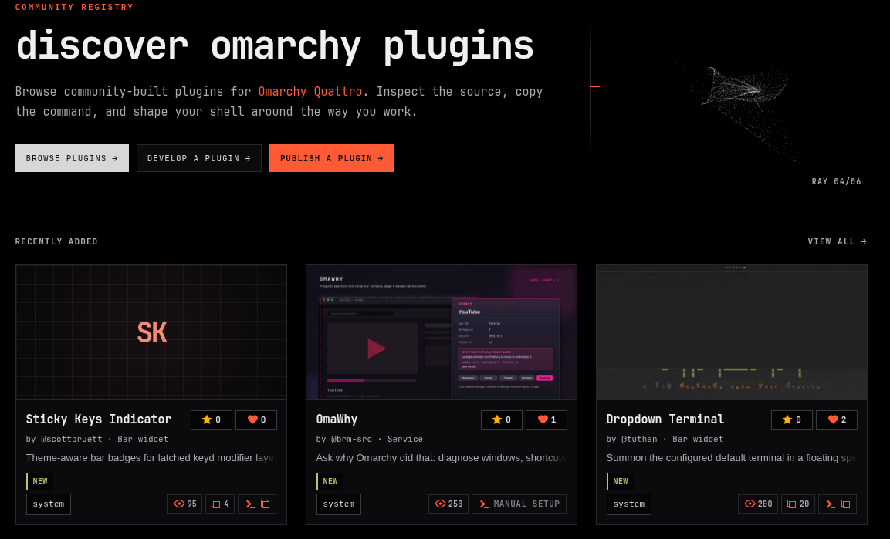

  

---

  

## Submit a Plugin

Submit one public GitHub repository containing the required manifest, README, and license through the [plugin submission form](https://github.com/omacom/omarchy-plugin-marketplace/issues/new?template=submit-plugin.yml). Choose a category and one to three tags, then review the [CLI and AI submission guide](SUBMISSION.md) and [security policy and baseline](SECURITY.md#automated-security-baseline). New listings require a fresh exact-commit scan and an explicit `approved-and-verified` maintainer decision before publication.

## Verify or Update a Listed Plugin

Use the single [plugin verification form](https://github.com/omacom/omarchy-plugin-marketplace/issues/new?template=verify-plugin.yml) and choose whether to verify the currently listed snapshot or publish a newer upstream commit. A listed-snapshot request accepts only the exact recorded SHA. A newer-commit request keeps the current snapshot unchanged until the target SHA passes compatibility validation, the Automated Security Baseline, explicit maintainer approval, testing, and deployment. The [verification guide](VERIFICATION.md) explains both paths, display states, required values, and limits.

## Engagement Metrics

The marketplace shows anonymous aggregate detail views, successful command copies, and hearts. These are marketplace interactions—not downloads, installations, unique people, verified votes, rankings, or security signals.

Event bodies contain only the catalog plugin ID and fixed action type. The marketplace stores no accounts, cookies, IP addresses, user-agent strings, command text, or repository URLs in D1. Cloudflare processes normal request metadata and uses the request IP only as an ephemeral edge rate-limit key; browser guards and rate limits remain best-effort controls.

## Security Notice

> Community plugins are developed and maintained by independent third parties. They execute as unsandboxed code and may access or modify files,
> settings, credentials, network resources, or other parts of your system according to their implementation and permissions.

> The Marketplace performs limited automated checks on the identified plugin commit and may conduct manual review. These checks are not a security
> audit, certification, endorsement, or guarantee that a plugin is safe, secure, error-free, or suitable for a particular purpose. Upstream code may
> change after review unless the installed version is explicitly pinned to the reviewed commit. Current Omarchy marketplace install and update commands clone mutable upstream HEAD and are not verification-bound.

> Before installation, review the plugin’s source code, requested capabilities, dependencies, and installation and removal instructions. Report
> suspected malicious or compromised plugins immediately through the [private security report form](https://github.com/omacom/omarchy-plugin-marketplace/security/advisories/new). The Marketplace may suspend or remove listings while concerns are investigated.

> Nothing in this notice excludes or limits liability where exclusion or limitation is prohibited by applicable law.

## Credits

Interface design inspired by [bjarneo](https://github.com/bjarneo)'s [ContextOwl developer documentation](https://developer.contextowl.co/docs/platform/cli).

Marketplace structure and submission workflow inspired by [limehawk's Omarchy Theme Website](https://github.com/limehawk/omarchy-theme-website).

## License

[MIT License](LICENSE) · [Marketplace and third-party rights notice](NOTICE.md)
